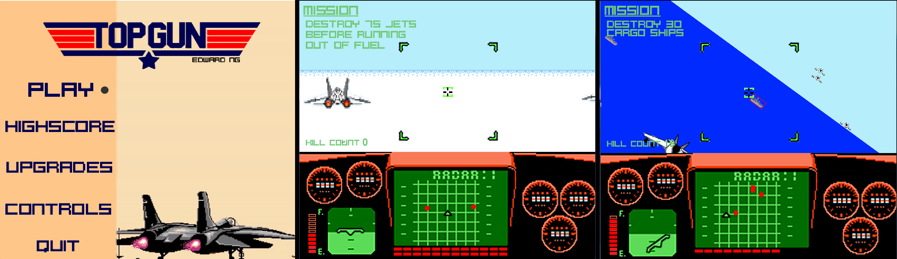
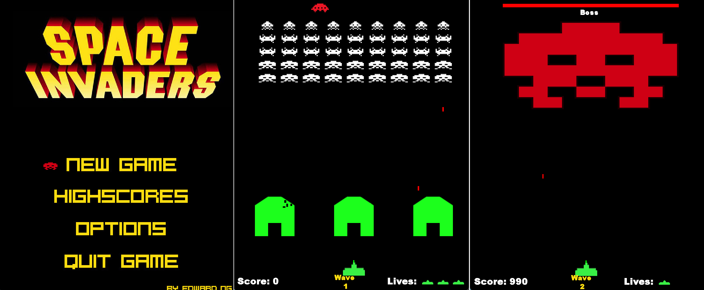
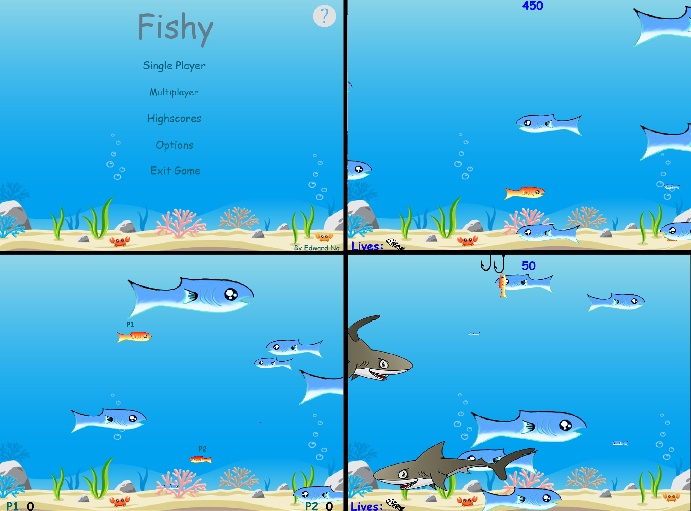

# Minigames by Edward Ng (2015 - 2018)

Some high school game projects I created:

# Top Gun
 First person shooter game where you play as a jet fighter progressing through three levels in the story.
 
 Upgradable jet, highscores and control customization.
 
 

# Space Invaders
 The classic Space Invaders game with a boss level.
 
 Customizable character, difficulty setting and highscores.
 
 
 
# Fishy
 Start off as a small fish and become larger as you consume smaller fish to survive.
 
 Customizable character, difficulty setting, multiplayer and highscores.
 
 
 
# Pong and Brick Breaker
 Classic Pong and Brick Breaker packaged in the same game.
 
# Tic-Tac-Toe
 Classic Tic-Tac-Toe.
 
# Hang Man
 Classic Hang Man.
 
 
 # TODOs:
 
 better readibility
 
 update coding style
 
 combine all games so it would be playable on one executable
