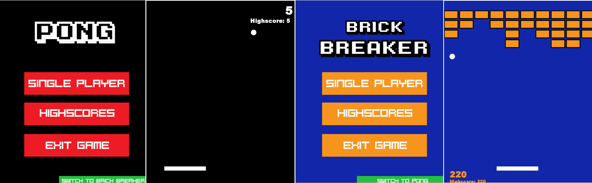
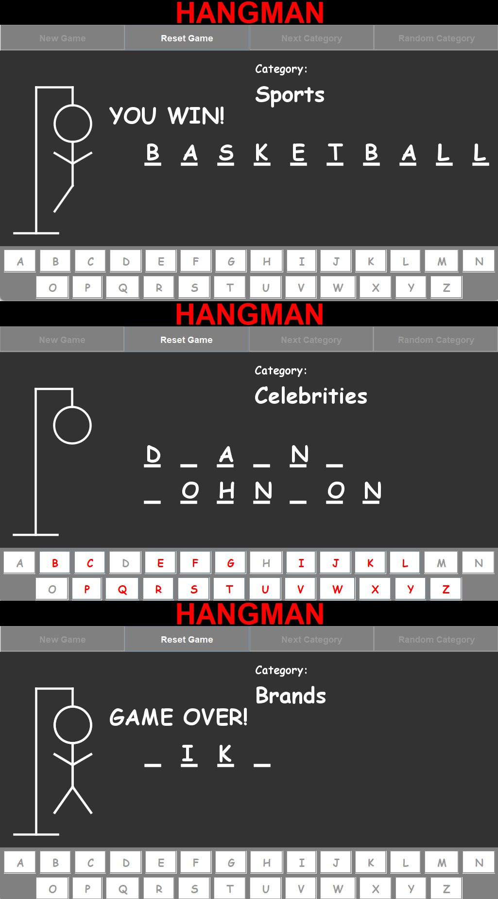

# Minigames by Edward Ng (2017 - 2018)

Some games projects I created back in high school when I first learned programming. The code is fairly messy and does not have the greatest coding style, however I believe I have improved on it since then. This repo mainly showcases the final products that I created using Java draw panel, shape collisions, and file I/O:

# Top Gun (2018)
 First person shooter game where you play as a jet fighter progressing through three levels in the story. As you play you can earn money to upgrade your jet to increase health and increase damage. All progress will be saved with high scores that can be reset so the game can be replayed over again.

I created resource files using Photoshop to input into draw panel where I was able to animate them. To give a more 3-D feel without using any advanced mathematics, I used an art concept of tunnel depth - where small objects in the center of your 2-D vision can appear as if they are approaching you if they increase in size. Simple rotation calculations are used to rotate the draw panel to create tilt motions of the jet. The collisions are based on shape coordinates and a function call occurs for the appropiate action when this happen. The progress and configurations are then tracked by certain flags and variables which are then saved to a text file to load for later use.
 
 

# Space Invaders (2018)
 An endless Space Invaders with added boss level. Try to defend your ship from the incoming waves of aliens and achieve new high scores. With certain achievements, new characters are unlockable. The game has a variety of settings for controls and increasing diffculty. All progress will be saved with high scores that can be reset so the game can be replayed over again.
 
 The resource files were once again made in Photoshop to animate in Java draw panel. The game uses simple math to create movement and uses shape collision between objects. There are flags used to track progress which are saved in a text file for later use.
 
 
 
# Fishy (2017)
 Start off as a small fish in the sea and grow larger as you consume smaller fish to survive. This survival game consist of many unlockable characters and difficulty settings that will change the gameplay. In addition, there is a two player multiplayer mode where you compete to stay alive. All progress will be saved with high scores that can be reset so the game can be replayed over again.
 
 The resource files were once again made in Photoshop to animate in Java draw panel. The game uses simple math to create movement and uses shape collision between objects. There are flags used to track progress which are saved in a text file for later use.
 
 
 
# Pong and Brick Breaker (2017)
 Classic Pong and Brick Breaker packaged in the same game. As the player progresses, the difficulty increases. All progress will be saved with high scores that can be reset so the game can be replayed over again.

 Uses Java draw panel to animate the ball, paddles and bricks. Uses shape collisions to detect when the ball collides with an object.

 
 
# Tic-Tac-Toe (2017)
 Classic two player Tic-Tac-Toe.

 Uses a Tkinter GUI that allows players to select buttons that mark it either 'X' or 'O' based on who's turn. The player wins when their marker lines up three in a row and is checked by basic if-conditions.

 
 
# Hang Man (2018)
 Classic Hang Man, where the player can guess words in a word bank from a specific category.

 Uses a Java Swing GUI where the players can guess letters that will grey out to avoid repetition. The result of the guess will show as an added part to the hang man or the letter to fill in the blanks. Uses basic list and control flows to compare results and win conditions.

 

